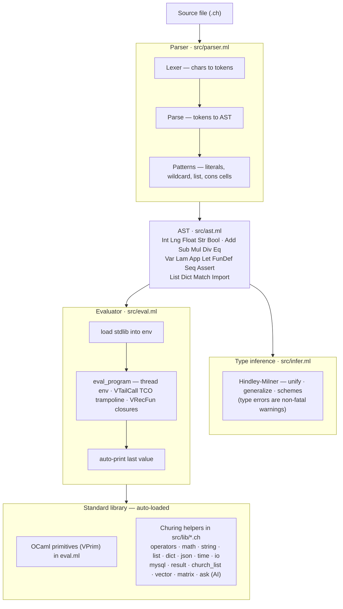

# Churing

A functional programming language named after [Alonzo Church](https://en.wikipedia.org/wiki/Alonzo_Church) and [Alan Turing](https://en.wikipedia.org/wiki/Alan_Turing) — the founders of computation theory. Church invented lambda calculus; Turing defined the universal machine. Churing brings both ideas together in one language.

> **Direction:** Churing is evolving into an **AI-native functional language** — one where LLM/model calls are first-class, typed, composable effects (`ask`), and the type system reasons about non-determinism and structured output. Errors are values (a monadic `Result`), not exceptions. See [`docs/ai-native-design.md`](docs/ai-native-design.md).

## Quick Example

```
~fib n (match n | 0 -> 0 | 1 -> 1 | x -> fib (x - 1) + fib (x - 2))

fib 10
```
Output: `55`

No boilerplate — define functions and reduce to a value. The last expression is the program's return value.

## Core Features

### Pure Lambda Calculus Feel
- No `print` — programs reduce to a single return value
- No `main` block required — top-level expressions execute directly
- Standard library auto-loaded — no import statements needed
- Church-style booleans: `true a b = a`, `false a b = b`

### Type System
- Basic types: `Int`, `Long` (64-bit), `Float`, `Bool`, `String`, `List`, `Dict`
- Function types (curried)
- Hindley-Milner type inference with let-polymorphism

### Pattern Matching
```
~eval expr (match expr
    | 0 -> "zero"
    | n -> str ["number: ", toString n])

~len l (match l
    | [] -> 0
    | h :: t -> 1 + len t)
```
Patterns: literals, variables, wildcards (`_`), lists (`[x, y]`), cons destructuring (`h :: t`).

### Lists (Three Approaches)
```
# Native lists with literal syntax
@nums [1, 2, 3, 4, 5]
map (|>x. x * 2) nums              # [2, 4, 6, 8, 10]
filter (|>x. gt x 3) nums          # [4, 5]
foldl (|>acc. |>x. acc + x) 0 nums # 15

# Cons cells (Lisp-style)
cons 0 nums                         # [0, 1, 2, 3, 4, 5]

# Church-encoded lists (pure lambda calculus)
@cl (church_cons 1 (church_cons 2 church_nil))
church_sum cl                       # 3
```

### Dictionaries and JSON
```
# Native dict literal
@user {name: "Alice", age: 30, active: true}
get user "name"                     # "Alice"

# JSON roundtrip
toJson user                         # '{"name":"Alice","age":30,"active":true}'
@parsed (fromJson "{\"x\": 1}")
get parsed "x"                      # 1
```

### Error Handling — monadic Result (errors are values)
```
# Pure failures use safe* guards (no exceptions)
unwrapOr 0 (safeDiv 10 0)           # 0   (safeDiv returns an err)

# I/O / parse failures: `attempt` catches into a Result
@safe (unwrapOr "default" (attempt (|>_. readFile "missing.txt")))

# Compose with matchResult / mapResult / bindResult
matchResult (safeGet user "email") (|>v. v) (|>e. "no email")
```

### String Building
```
@name "Alice"
@age 30
str ["Hello ", name, ", age ", age]  # "Hello Alice, age 30"
join ", " ["a", "b", "c"]           # "a, b, c"
```

### Comparison Operators
```
gt 5 3       # true
lt 2 10      # true
gte 3 3      # true
filter (|>x. gt x 3) [1, 2, 3, 4, 5]  # [4, 5]
```

### MySQL Database Access
```
@conn (mysqlConnect {host: "localhost", user: "root", password: "pass", database: "mydb"})
@users (mysqlQuery conn "SELECT * FROM users WHERE age > 25")
get (head users) "name"             # "Alice"
```

### Expressions
- Numeric literals: integers (`123`), longs (`123L`), floats (`3.14`, `.5`, `123f`)
- String literals (`"hello"`)
- Boolean literals (`true`, `false`)
- Lambda functions (`|>x. body`)
- Curried function application
- Arithmetic (`+`, `-`, `*`, `/`) with proper precedence
- Equality (`eq`) and comparison (`gt`, `lt`, `gte`, `lte`)
- Assertions (`assert`)
- Environment variables (`env "VAR"`, `envOr "VAR" "default"`)

### Declarations
```
@x 5                        # Variable (type inferred)
~add x,y x + y              # Named function (comma-separated args)
~fact n (match n             # Recursive (with tail call optimization)
    | 0 -> 1
    | n -> n * fact (n - 1))
```

## Standard Library

All functions are available without imports:

| Library | Functions |
|---------|-----------|
| **operators** | `true`, `false`, `not`, `and`, `or`, `if`, `env`, `envOr`, `gt`, `lt`, `gte`, `lte`, `identity`, `const`, `flip`, `compose` |
| **math** | `sqrt`, `sin`, `cos`, `tan`, `asin`, `acos`, `atan`, `exp`, `log`, `tanh`, `floor`, `ceil`, `round`, `abs`, `pow`, `min`, `max`, `random`, `pi`, `e`, `square`, `cube`, `clamp`, `lerp` |
| **string** | `length`, `concat`, `substring`, `uppercase`, `lowercase`, `trim`, `charAt`, `indexOf`, `startsWith`, `endsWith`, `replace`, `split`, `toString`, `toFloat`, `toInt`, `str`, `join`, `isEmpty`, `contains` |
| **list** | `nil`, `cons`, `head`, `tail`, `empty`, `len`, `nth`, `reverse`, `range`, `map`, `filter`, `foldl`, `foldr`, `matchList`, `matchBool`, `sum`, `product`, `any`, `all`, `take`, `drop`, `zip`, `flatten`, `append` |
| **dict** | `get`, `set`, `has`, `keys`, `values`, `merge`, `remove`, `entries`, `fromEntries`, `assocGet`, `assocSet`, `assocHas`, `assocKeys`, `assocValues` |
| **json** | `toJson`, `fromJson` |
| **time** | `now`, `timeMs`, `year`, `month`, `day`, `hour`, `minute`, `second`, `dayOfWeek`, `diffTime` |
| **io** | `readFile`, `writeFile`, `appendFile`, `fileExists`, `deleteFile`, `readLines`, `writeLines`, `pureIO`, `bindIO`, `mapIO`, `runIO` |
| **mysql** | `mysqlConnect`, `mysqlQuery`, `mysqlExec`, `mysqlClose`, `mysqlFindOne`, `mysqlFind` |
| **result** | `ok`, `err`, `matchResult`, `mapResult`, `bindResult`, `unwrapOr`, `isOk`, `isErr`, `safeDiv`, `safeHead`, `safeTail`, `safeNth`, `safeGet`, `attempt` |
| **church_list** | `church_nil`, `church_cons`, `church_head`, `church_sum`, `church_map`, `church_fold`, `church_length` |
| **vector** | `vecAdd`, `vecSub`, `vecMul`, `vecScale`, `vecDot`, `vecSum`, `vecMap`, `vecZipWith`, `vecRandom`, `vecZeros`, `vecConst`, `argmax` |
| **matrix** | `matVecMul`, `matCol`, `matTranspose`, `outerProduct`, `matAdd`, `matScale`, `matRandom`, `matZeros` |

## Architecture

> Interpreter-only — no compiler/backend. Source is parsed, type-inferred (non-fatal), then evaluated.



### Key Mechanisms

**Closures & Recursion** — Functions capture their defining environment. `VRecFun` stores the function's own name in the closure, enabling self-reference without mutation.

**Tail Call Optimization** — The evaluator uses a trampoline: tail calls return `VTailCall(fn, arg)` instead of recursing. The `force()` function unwinds the chain iteratively, preventing stack overflow for deep recursion (tested to 100k+ depth).

**Church Encodings** — Booleans (`true a b = a`), lists (`church_cons`), and results (`ok`/`err`) are implemented as pure lambda functions. `matchBool` and `matchList` are Scott-encoded eliminators that enable lazy branching.

**Hybrid Standard Library** — Each module has two layers: native OCaml primitives (registered in `eval.ml` as `VPrim` functions) for performance-critical operations, and Churing-level helpers (in `src/lib/*.ch`) built on top. For example, `map` is a native primitive, while `sum` is defined in Churing as `foldl (|>acc. |>x. acc + x) 0`.

## Usage

```bash
# Build (requires Docker)
docker build -t churing-test .

# Run a program
./run.sh example.ch

# Run all tests (unit + integration)
./run-tests.sh

# Run a single test
./run-tests.sh 12_lambda

# Run database tests (spins up MySQL via Docker Compose)
./run-tests-db.sh
```

## Design Philosophy

Churing honours its namesakes by combining Church's lambda calculus with Turing's practical computability. The language aims to feel like pure lambda calculus — programs are expressions that reduce to values — while providing practical features (pattern matching, lists, dictionaries, I/O, error handling, database access) through both native primitives and Church-encoded alternatives.

Every major feature offers two approaches:
- **Native** — practical and efficient
- **Church-encoded** — pure lambda calculus, implemented in Churing itself

This lets users choose their level of abstraction: native lists for convenience, or Church-encoded lists to stay true to lambda calculus.

**Where it's heading.** Churing's active direction is to be *AI-native*: to make LLM/model calls first-class, typed, composable effects (`ask`), so programs that orchestrate models stay pure, type-checked, and able to reason about non-determinism and structured output. Pure functions, a monadic `Result`, JSON, and structured data are the substrate. Earlier explorations (a native LLVM compiler, an ML/tensor stack, CUDA, web, AWS) are parked — see [`docs/ai-native-design.md`](docs/ai-native-design.md).
